# Analiza datelor de intrare

## Analiza seturilor de date disponibile

### Factori de decizie

Alegerea setului de date pentru antrenarea modelului influențează direct performanța soluției noastre. 
În acest sens, trebuie să evaluăm cu atenție caracteristicile fiecărui set de date disponibil, în 
funcție de mai mulți factori critici.

#### 1. Dimensiunea setului de date

Numărul total de imagini și de pacienți reprezintă un indicator important al diversității și relevanței 
datelor. Fiecare caz include mai multe mamografii pentru un pacient, de obicei în perechi.
Este esențial ca modelul să învețe dintr-o varietate de exemple, atât normale cât și patologice, pentru 
a generaliza corect în aplicații reale.

#### 2. Volumul de date pentru fiecare pacient

Un alt aspect important este câte imagini sunt asociate fiecărui caz și ce perspective sunt disponibile
(CC = Craniocaudal și MLO = Mediolateral oblique). Un set care include aceste perspective multiple va 
permite modelului să învețe caracteristici din unghiuri diferite, apropiindu-se mai mult de modul în care 
radiologii interpretează cazurile.

| 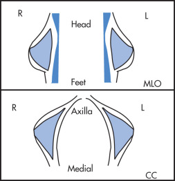 | 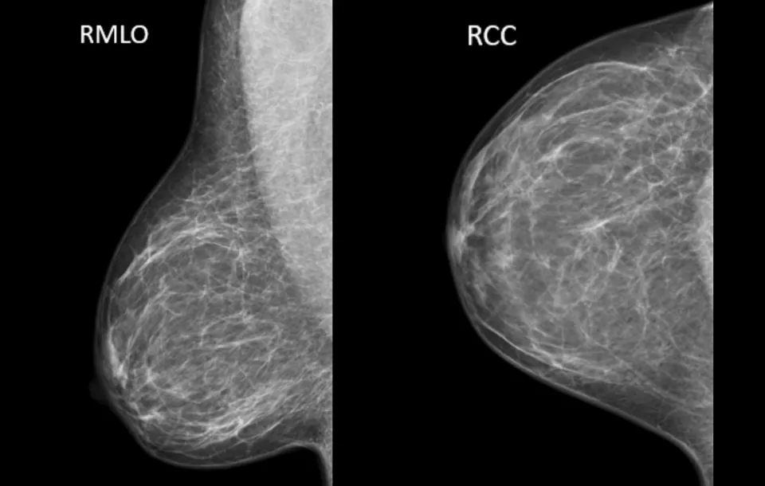 |
|:----------------------------------:|:------------------------------------:|
| **Schema vederilor mamografice**   | **Exemple de imagini mamografice**   |

Astfel, am putea avea pentru un set de date cu 1000 de imagini:
1. dacă pentru fiecare pacient avem 4 imagini (CC si MLO, dreapta și stânga), avem 250 de pacienți
2. dacă avem un singur view și câte 2 imagini, avem 500 de pacienți
3. dacă avem mai multe mamografii, adunate de-a lungul timpului, pentru fiecare pacient, 
avem mult mai puține cazuri clinice efective

Surse imagini:  
https://radiologykey.com/breast-imaging-10/  
https://www.openmed.co.in/2021/05/standard-views-of-mammography.html  
https://www.mtmi.net/webinar/essentials-standard-projections-cc-and-mlo-views

#### 3. Localizarea leziunilor

Pentru sarcini precum detecția leziunii, este esențial ca setul de date să conțină adnotări 
precise privind locația (bounding boxes, coordonate, radius) anomaliei (mase și calcificări).
În absența acestor informații, modelul va avea dificultăți în învățarea regiunilor relevante din imagine.

#### 4. Tipul de etichetare

Etichetarea datelor este esențială pentru stabilirea scopului modelului - clasificare sau detecție. 
Etichetele pot varia de la clasificări simple (malign/benign) până la scoruri 
[BI-RADS](https://www.reginamaria.ro/articole-medicale/sanatatea-familiei/ce-inseamna-bi-rads), care oferă 
o estimare gradată a riscului de malignitate. Alegerea unui set de date care conține etichete 
coerente și standardizate este crucială pentru a antrena un model care poate fi comparat sau 
validat în contexte clinice.

#### 5. Relevanță clinică și bias

În alegerea imaginilor trebuie să ținem cont și de:

    - Distribuția echilibrată între clase (malign vs. benign vs. normal)

    - calitatea imaginilor
    
    - tipul de mamografie (ex. digitală, analogică dar apoi scanată)

Alte informații utilizate de medic în diagnostic, care nu sunt vizibile în imagini, sunt:

    - istoricul familial al pacientului

    - vârsta, densitatea sânului

    - tipul de leziune (ex. calcificări, mase)

Concluzie

În funcție de scopul aplicației noastre – fie că alegem clasificare simplă sau localizare a leziunilor,
trebuie să alegem un set de date care:

    1. Are un număr suficient de imagini și pacienți

    2. Oferă etichete clinice relevante (ex. BI-RADS, malignitate)

    3. (+) Conține informații despre locația anomaliilor

    4. (+) Include multiple perspective per caz

### [MIAS](http://peipa.essex.ac.uk/info/mias.html) 

Setul de date conține **322** de imagini mamografice digitale, fiecare având dimensiunea de **1024x1024** pixeli. 

Avem o clasificare a leziunilor în 5 tipuri și o clasificare a țesutului înconjurător în 3 tipuri.
Acestea sunt utilizate mai mult de cadrele medicale pentru a aproxima șansele de a avea o leziune malignă.

Cazurile sunt etichetate cu informații despre leziuni, inclusiv localizarea acestora prin coordonate și rază, care
ne pot ajuta în focalizarea atenției modelului asupra zonelor relevante din imagine. Pentru mamografiile cu mai multe 
zone afectate, sunt specificate toate centrele. În unele cazuri însă, masele sunt răspândite uniform,
așa că această informație lipsește, considerându-se că întreaga zonă este afectată, iar diagnosticul este malign.

Mamografiile sunt date sub format .pgm (Portable Gray Map), care este un format de imagine grayscale.
Nu există informații legate de numărul de pacienți, iar imaginile sunt tratate asemeni unor cazuri distincte. Cu toate acestea,
ele sunt în perechi (numerotate cu 2 * k + 1 dreapta, 2 * k + 2 stânga). Nu avem informații despre tipul de mamografie 
(analogică sau digitală). Observăm din imagini și din notațiile de pe mamografii că perspectiva este MLO (Mediolateral oblique).

Mai jos avem un exemplu de imagine din setul de date MIAS, care conține o leziune malignă. Am încercuit zona afectată
cu verde, iar apoi am încercat să evidențiem zona albă din imagine.

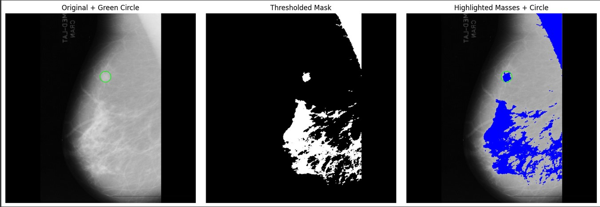

Distribuția cazurilor în funcție de diagnostic este următoarea:

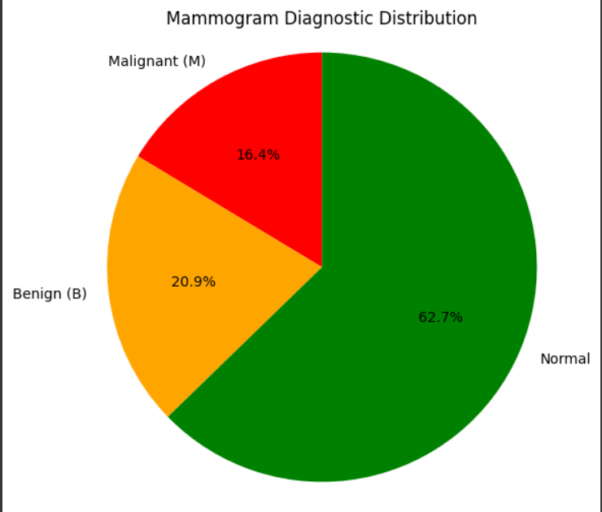

Așadar nu avem un set de date echilibrat.

### [DDSM](http://www.eng.usf.edu/cvprg/Mammography/Database.html)

DDSM (Digital Database for Screening Mammography) este o bază de date publică ce conține imagini mamografice digitale utilizate în cercetare pentru dezvoltarea și testarea algoritmilor de detecție automată a cancerului mamar.

În cadrul DDSM, datele sunt distribuite in "case-uri" și "volume". Un "case" este o colecție de imagini și
informații legate de mamografia unui singur pacient. Un "volume" este o colecție de "case-uri" cu scopul
de a distribui datele mai convenabil.

Un "case" are între 6-10 file-uri: Un "ics" file, un overview "16-bit PGM", 4 LJPEG-uri și 0-4 overlay files.

Structura unui "case":

Structura unui "ics":

Fișierul "ics" conferă informații legate de cazul unui pacient per total, cum ar fi:
- data la care s-a făcut studiul
- vârsta pacientului
- data digitalizării informațiilor
- tipul de instrument folosit pentru digitalizare
- o listă cu imaginile digitalizate

Descriere LJPEG:

Chiar și cu o compresie de tip LOSSLESS JPEG, fișierele au în continuare o dimensiune mare din cauză că pozele originale au fost făcute pe o rezoluție între 42 și 100 de microni. 
[Source code](ftp://havefun.stanford.edu/pub/jpeg/JPEGv1.2.1.tar.Z) pentru programul folosit la compresie de la Stanford University.
Pentru decompresie s-a folosit o versiune de SunOS 5.5.

Structura unui Overlay:

"Case-urlie" anormale au în componența lor între 1 și 4 Overlay file-uri, numărul depinzând de numărul de imagini în care s-au reperat anormalități. Pentru fiecare anormalitate avem tipul leziunii, evaluarea, subtilitatea, patologia și cel puțin o conturare. 

Descriere ".16_PGM":

Acest fișier conține cele 4 imagini LJPEG concatenate și are rolul de a oferi posibilitatea unei aruncări de
privire asupra pozelor care urmează a fi analizate. Imaginile sunt de o calitate slabă sub această formă, dar își îndeplinesc scopul.

#### Tipuri de volume:

Volume normale: Conțin cazuri preluate din examene de screening anterioare ale unor pacienți care au avut un rezultat normal și cel puțin 4 ani mai târziu tot unul normal. Aceste examene nu au necesitat investigații suplimentare.

Volume cancer: Conțin examene de screening în care a fost detectat cel puțin un cancer confirmat prin patologie.

Volume benigne: Conțin cazuri unde s-a observat ceva suspect, dar s-a dovedit că nu este malign, prin patologie, ecografie sau alte metode.

Volume benigne fără reevaluare (callback): Sunt cazuri benigne în care nu s-au făcut filme suplimentare sau biopsii, dar imaginile au avut aspecte suficient de suspicioase încât radiologul să le marcheze.

Observație: Unele cazuri de cancer pot include și regiuni suspecte neconfirmate patologic, pe lângă cele confirmate.

### [INbreast](https://www.kaggle.com/datasets/tommyngx/inbreast2012)

Setul de date INbreast 2012 este un dataset de mamografii de înaltă calitate, colectat în cadrul Instituto de Engenharia Biomedica (INEB) din Portugalia și include imagini digitale de mamografie obținute cu ajutorul echipamentului Full-Field Digital Mammography (FFDM).

#### Dimensiunea si volumul setului de date ####
INbreast contine un total de 115 cazuri, 410 imagini mamografice in format DICOM.  
Dintre cele 115 cazuri:   
    - *90 de cazuri* sunt de la paciente cu ambii sani prezenți (4 imagini per caz: două pentru fiecare sân, în proiecțiile MLO (Mediolateral Oblique) și CC (Cranio-Caudal)) => 360 imagini  
    - *25 de cazuri* de la paciente care au suferit masectomie(2 imagini corespunzatoare sanului ramas). => 50 imagini    

 
**Mamografie-4 imagini/caz** (a) Vedere craniocaudală (CC) a sânului drept;  
(b) Vedere CC a sânului stâng;  
(c) Vedere oblică mediolaterală (MLO) a sânului drept;  
(d) Vedere MLO a sânului stâng.  

#### Localizare leziuni și tipuri de etichetare ####
Imaginile includ mai multe tipuri de leziuni mamare, precum: mase, microcalcificari, asimetrii, distorsiuni arhitecturale.
Contururile precise ale leziunilor sunt de asemenea disponibile in format XML.
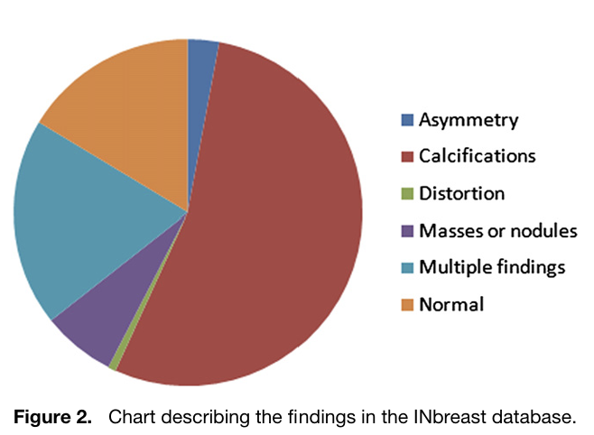

Localizarea leziunilor este detaliată și extrem de precisă, ceea ce o face valoroasă pentru cercetarea în imagistica medicală, mai ales în dezvoltarea și validarea algoritmilor de detecție automată.
Pentru mase, calcificări, distorsiuni, asimetrii și mușchiul pectoral, au fost realizate contururi precise, trasate manual de specialiști. Clusterele de calcificări sunt marcate printr-o elipsă care înconjoară întregul grup, dar fiecare microcalcificare este de asemenea adnotată individual (în total 6.880 de calcificări în 299 imagini ~23.0 calcificatii per imagine).Calcificările sunt prezente în 301 din cele 410 imagini.

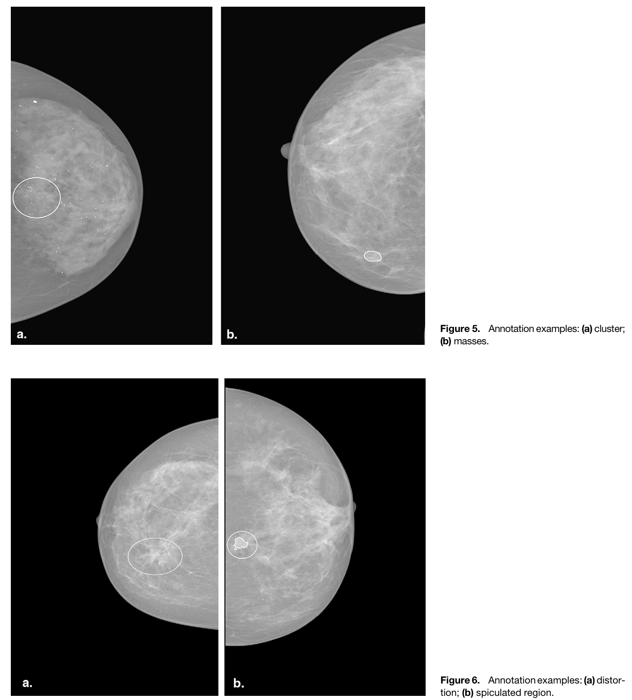

Adnotările sunt salvate in format XML. Fiecare ROI(Region of Interest) are:  
    - coordonatele centrului   
    - tipul leziunii (ex: „mass”, „calcification”)  
    - conturul leziunii (listă de puncte într-o structură <array>)   

Masele sunt distribuite in 107 imagini, cu o medie de 1,1 mase per imagine. Dimensiunile maselor variaza între 15 mm² și 3689 mm².  

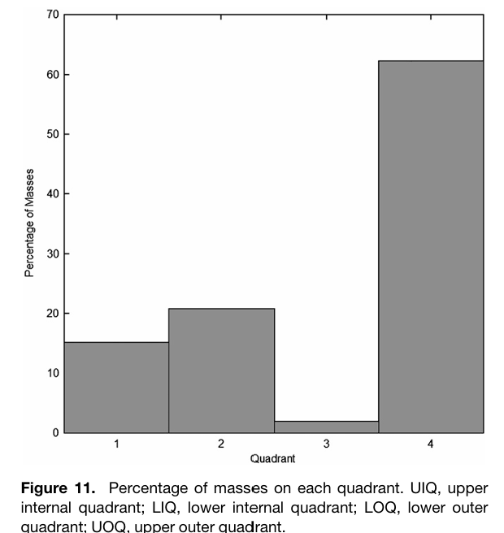

Fiecărei imagini i se asociază și o clasificare conform BI-RADS și densitatea sânului conform ACR. Pentru cazurile BI-RADS 3, 4, 5 și 6, sunt oferite și rezultatele biopsiei, acolo unde aceasta a fost efectuată.   

#### Relevanță clinică și bias ####

Distribuția datelor este prezentată mai jos.   
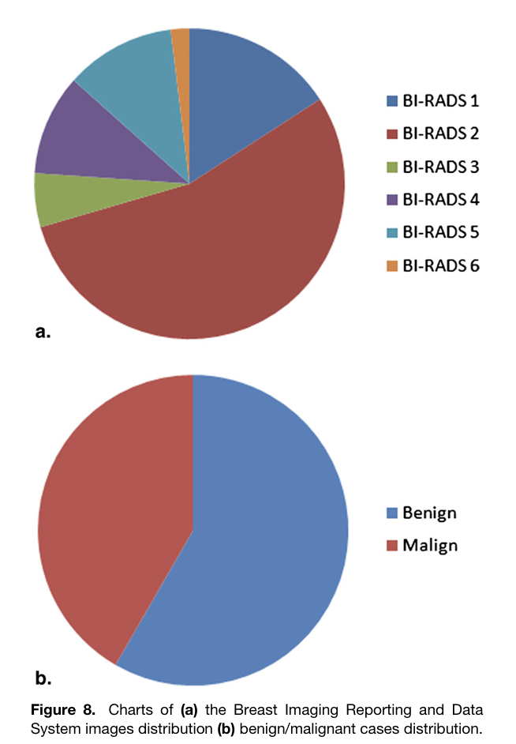    
*Interval de vârstă:* Pacientele au vârste cuprinse între aproximativ 35 și 90 de ani. Vârsta medie crește ușor odată cu scorul BI-RADS. Cazurile BI-RADS 5 și 6 (probabil maligne și maligne confirmate) tind să aibă mediană mai mare, în jur de 65–70 ani.    
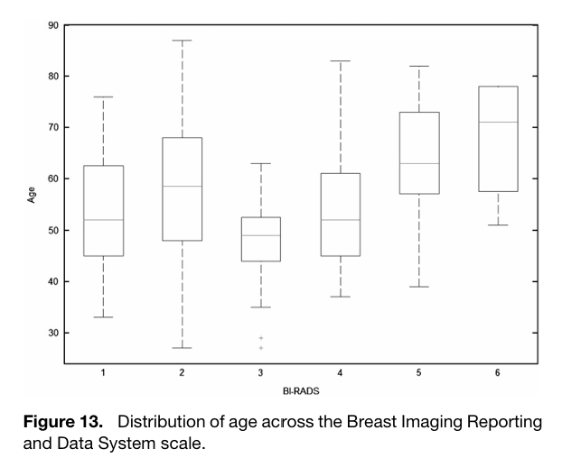    

#### Concluzii ####   
INbreast este considerată o bază de date unică, datorită Mamografiilor digitale full-field (FFDM) (fără pierdere de calitate prin digitizare), adnotărilor detaliate (contururi precise, nu doar cercuri sau marcaje vagi), varietăților mari de cazuri. Totuși, baza de date are un număr relativ mic de cazuri și imagini, comparativ cu alte baze de date mari utilizate în cercetarea în imagistica medicală ceea ce ar putea duce la overfitting.  De aceea, este adesea folosit în combinație cu alte baze de date sau pentru teste de segmentare și clasificare de finețe, nu pentru antrenamente masive.    

### [DBT](https://www.cancerimagingarchive.net/collection/breast-cancer-screening-dbt/)

Acest set de date oferă imagini DBT pentru 5 060 de paciente, împărțite în patru categorii:
- normale
- cate necesită investigații suplimentare
- benigne confirmate prin biopsie
- maligne confirmate prin biopsie 
și este conceput pentru antrenarea și validarea algoritmilor de învățare automată în detectarea leziunilor mamare.

Componență:
- Imagini DICOM (3D - folosind "felii") 
- Fișier tabelar cu gruparea fiecărui caz
- Cutii de anotare pentru mase și distorsiuni arhitecturale
- Căi de acces pentru pacienți, studii și proiecții

Datele:
- Total: 22032 scans
- Training: 19148 scans
- Validation: 1163 scans
- Test: 1721 scans

Parametri:
* **PatientID**: șir de caractere – identificatorul pacientului
* **StudyUID**: șir de caractere – identificatorul studiului
* **View**: șir de caractere – denumirea proiecției, una dintre: RLL, LCC, RMLO, LMLO (poate avea un sufix numeric dacă există mai multe imagini pentru aceeași proiecție)
* **Subject**: număr întreg – codifică radiologul care a realizat anotarea
* **Slice**: număr întreg – indexul feliei centrale care conține leziunea biopsiată
* **X**: număr întreg – coordonata X (axa orizontală) a marginii stângi a casetei de delimitare prezise, în indexare de la 0 (pentru coloana cea mai din stânga, X = 0)
* **Y**: număr întreg – coordonata Y (axa verticală) a marginii de sus a casetei de delimitare prezise, în indexare de la 0 (pentru rândul cel mai de sus, Y = 0)
* **Width**: număr întreg – lățimea casetei de delimitare prezise (pe axa orizontală)
* **Height**: număr întreg – înălțimea casetei de delimitare prezise (pe axa verticală)
* **Class**: șir de caractere – tipul leziunii prezise: „benign” sau „cancer”
* **AD**: număr întreg – 1 dacă este prezentă distorsiunea arhitecturală, altfel 0
* **VolumeSlices**: număr întreg – numărul total de felii din volumul care conține caseta de delimitare (folosit în funcția de evaluare)
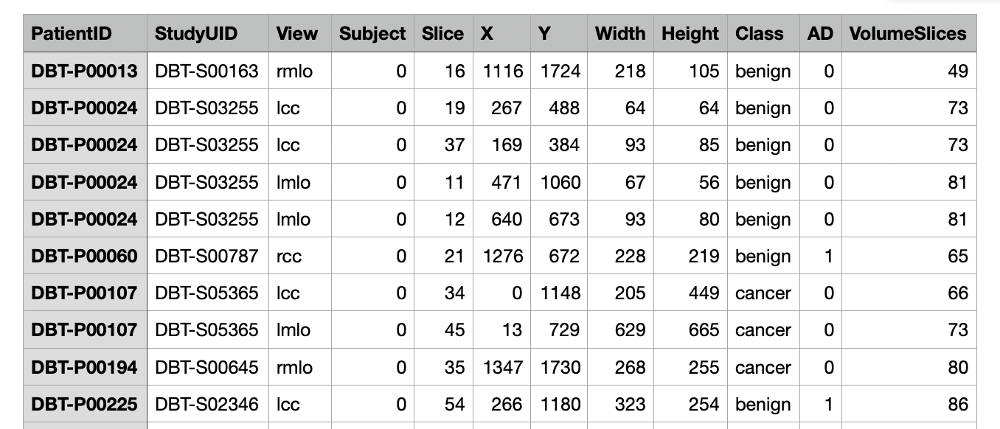

- pentru majoritatea studiilor sunt disponibile 4 proiecții (două pentru fiecare sân: craniocaudală și oblic mediolaterală)
- unele examinări nu sunt complete

Marcaje:
- zonă încercuită unde s-a putut obseva o secțiune elevată pe piele:
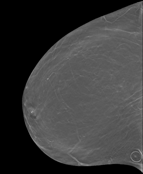

- localizarea zonelor dureroase
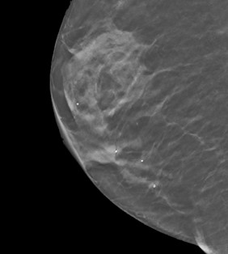

- evidențierea mamelonului pentru a nu fi confundat cu vreo leziune
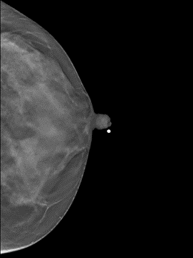

Concluzie:
Setul BCS-DBT este, per ansamblu, unul foarte cuprinzător pentru cercetarea în detecția computerizată a leziunilor mamare: date pentru peste 5 000 de paciente, acoperă atât cazuri normale, cât şi cele cu leziuni benigne sau maligne confirmate prin biopsie, şi include anotări de înaltă calitate realizate de radiologi.

### [MammoVit](https://www.mdpi.com/2075-4418/15/3/285)

MammoViT este un model inovator dezvoltat pentru clasificarea automată a mamografiilor conform sistemului BI-RADS. Acesta utilizează o arhitectură hibridă, combinând un Vision Transformer (ViT), care procesează fiecare zonă suspectă, cu un model ResNet50, responsabil pentru extragerea caracteristicilor relevante (feature-urilor). Scopul principal al modelului este îmbunătățirea acurateței diagnostice și standardizarea interpretării mamografice, contribuind astfel la detectarea precoce a cancerului mamar.

Datele Utilizate:

Modelul a fost antrenat pe un set de date colectat între 2019 și 2020, care include:
- Segmente detaliate ale regiunilor de interes
- Etichete:
  - Vârstă
  - Procentajul țesutului glandular
  - Categoria BI-RADS

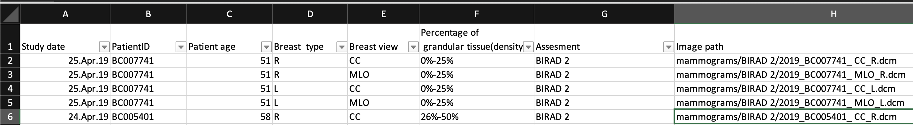

Distribuția Datelor BI-RADS:

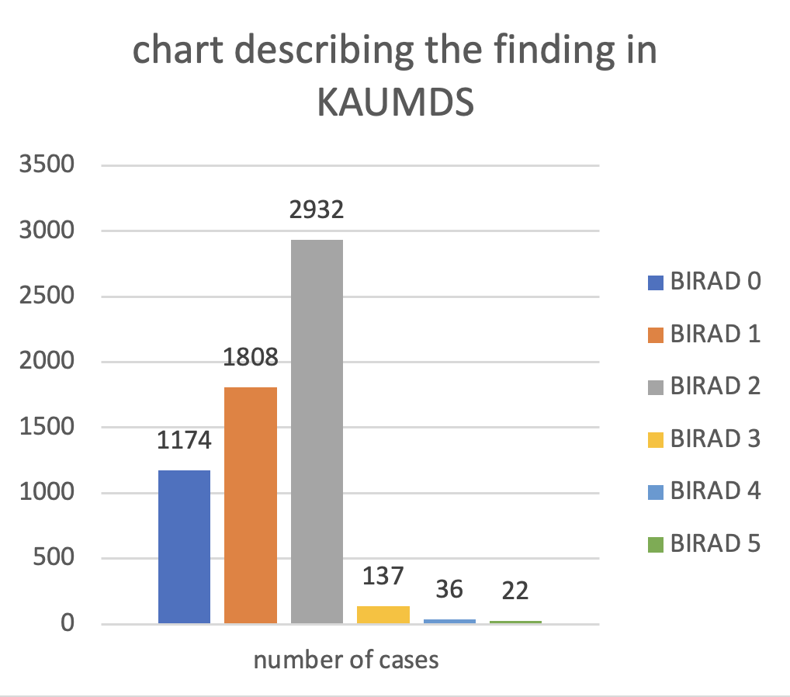

- **BI-RADS 1**: 1865 imagini cu etichete corespunzătoare  
- **BI-RADS 2**: 48% din totalul datasetului (nu sunt incluse în porțiunea etichetată, deoarece reprezintă leziuni benigne)  
- **BI-RADS 3**: 387 imagini cu etichete corespunzătoare  
- **BI-RADS 4**: 102 imagini cu etichete corespunzătoare  
- **BI-RADS 5**: 24 imagini cu etichete corespunzătoare

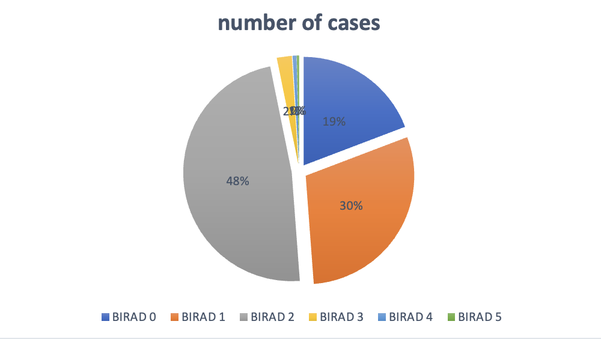

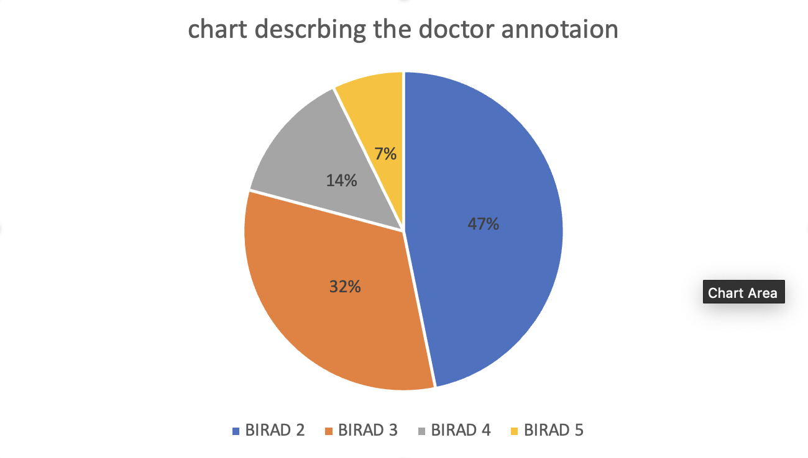

Arhitectura Vision Transformer:

1. Extragere Ierarhică de Caracteristici:
Combină:
- **Blocuri convoluționale** pentru captarea detaliilor locale
- **Mecanisme de atenție** pentru analiza globală a imaginii

2. Multi-Scale Patch Embedding:
- Segmentarea imaginii în patch-uri de dimensiuni variate: **16x16** și **32x32** pixeli
- Permite detectarea atât a **microcalcificărilor**, cât și a **maselor mari**

3. Channel Attention Module:
- Optimizează activarea marcajelor colorate pentru a evidenția regiunile clinic relevante

4. Clasificare Avansată BI-RADS:
- Layer specializat pentru predicția categoriilor **BI-RADS (1–6)** și estimarea riscului de malignitate
- Integrarea **datelor clinice** (vârstă, densitatea sânului) pentru decizii îmbunătățite

Preprocesare:
- **Normalizare adaptivă a contrastului** pentru imagini DICOM cu variații de luminozitate
- **Augmentare a datelor** prin rotații și flip-uri pentru antrenament robust

Performanță:
- **Acuratețe BI-RADS**: **94.2%**  _(cu 8.5% mai bună decât modelul ResNet-50 standard)_
- **AUC pentru BI-RADS 4–6**: **0.97**  _(indică o discriminare excelentă între leziuni benigne și maligne)_

## Alegerea setului de date
În alegerea setului de date trebuie să ținem cont și de arhitectura modelului pe care vrem sa-l creăm.
Am pornit de la studierea arhitecturii **MammoVit**, care este o rețea bazată pe Vision Transformer (ViT) și a fost antrenată 
pe un set numeros de imagini mamografice.

De aceea am decis să începem antrenarea modelului folosind setul de date INBreast, care conține imagini mamografice digitale
de înaltă calitate, dar în număr limitat. Vom folosi seturile de date MIAS și 
[KAU-BCMD](https://www.mdpi.com/2306-5729/6/11/111) - setul folosit pentru MammoVit - pentru validare.
În cazul în care modelul nu va avea o acuratețe suficient de mare, vom combina seturile de date (KAU-BCMD și INBreast) pentru antrenament,
iar MISA va fi folosit pentru testare.

## Preprocesare

Vom oglindi mamografiile MLO (stânga-dreapta) pentru a le aduce într-o formă standardizată, iar modelul să lucreze cu date cât mai similare,
fără a fi influențat de direcția sânului. Astfel, se va putea concentra pe caracteristicile imaginii și pe detecția leziunilor, iar toate 
mamografiile vor fi cu vârful sânului spre dreapta.

Din analiza arhitecturii MammoVit, am observat că aceasta, înainte de antrenare, realizează
o preprocesare a imaginilor prin normalizarea pixelilor și o extragere a caracteristicilor.
MammoVit face această extragere folosind o arhitectură modificată a [ResNet50](https://www.mathworks.com/help/deeplearning/ref/resnet50.html), 
o rețea neuronală convoluțională cu 50 de layers.

Noi vom încerca să realizăm preprocesarea printr-o serie de transformări, cum ar fi:
1. conversia la tonuri de gri
2. creșterea luminozității
3. creșterea contrastului
4. opțional redimensionarea imaginilor, în funcție de durata antrenării modelului
5. aplicarea de thresholding pentru a evidenția zonele albe din imagine
6. normalizarea intensității pixelilor

## Date de intrare, date de ieșire
Am decis ca rezultatul să fie una dintre cele două categorii (malign sau benign), cu precizarea că am considerat
maligne imaginile care s-ar încadra în categoria BI-RADS 4, 5 sau 6:
    
    BI-RADS 4 – Rezultat suspect, fiind o probabilitate de aproximativ 20-35% ca leziunea sa fie cancer. 
    Este recomandată biopsia.

    BI-RADS 5 – Rezultat cu probabilitate ridicată de malignitate de 95%. 
    Este necesară biopsia.

    BI-RADS 6 – Înseamnă că deja ai fost diagnosticată cu cancer de sân la examenul histologic. 
    Se recomandă intervenția chirurgicală.

Iar pentru imaginile care nu se încadrează în aceste categorii, am considerat că sunt benigne:

    BI-RADS 0 – Testare incompletă. Sunt necesare investigații imagistice suplimentare pentru colectarea 
    de mai multe informații.

    BI-RADS 1 – Rezultat negativ, adică nu este nimic semnificativ sau anormal de raportat. 
    Pentru femeile până în 40 de ani, se recomandă screening anual de rutină prin ecografie; pentru cele peste 40 de ani, 
    se recomandă screening anual prin mamografie.

    BI-RADS 2 – Rezultat normal, negativ pentru cancer, dar cu prezența unor leziuni benigne (chisturi, fibroadenoame, etc). 
    Se recomandă screening anual de rutină.

    BI-RADS 3 – Rezultat la limită. Poate indica un rezultat probabil benign, dar cu o șansă de cancer de sân de 
    aproximativ 2%. Trebuie sa repeți mamografia la interval scurt, de 6 luni. 
    Daca ai istoric familial sau personal de cancer de sân, medicul iți va recomanda teste suplimentare.

Cum fiecare spital are propriile protocoale de diagnosticare, este important să ne asigurăm că aplicația noastră
poate fi adaptată la diferite perspective ale imaginilor. De aceea, am decis să nu ne bazăm pe un singur set de date,
care ar conține ambele perspective (CC și MLO), ci să le tratăm separat, antrenând două modele distincte, dar mai performante.

Un alt motiv pe lângă diferențele protocoalelor de diagnosticare este că, în cazul mamografiei MLO, există un colț în partea de sus
în care axila este vizibilă, astfel apărând o zonă albă în imagine, care nu este relevantă pentru diagnosticare.

Vom avea un model care va analiza imaginile din perspectiva MLO și altul pentru perspectiva CC. Medicul va alege perspectiva 
imaginii în momentul în care va dori să facă analiza și va încărca imaginea.

Diagnosticul se va da în funcție de sânul analizat deoarece cancerul de sân poate apărea și în ambii sâni, dar și separat.

O viitoare extensie a aplicației ar putea include și identificarea zonelor afectate.
