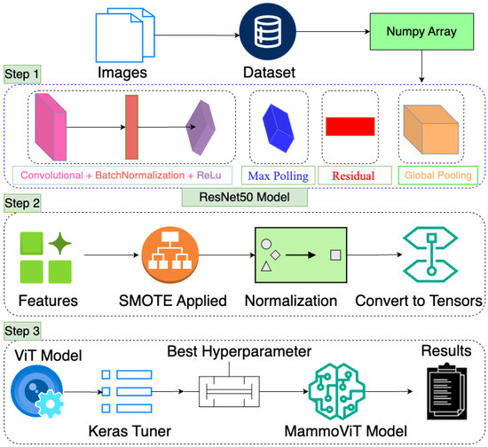
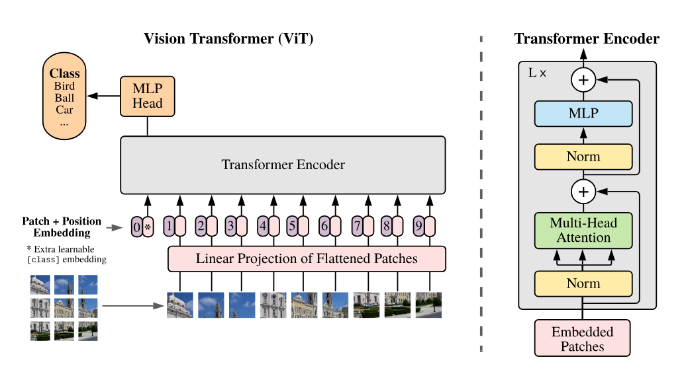
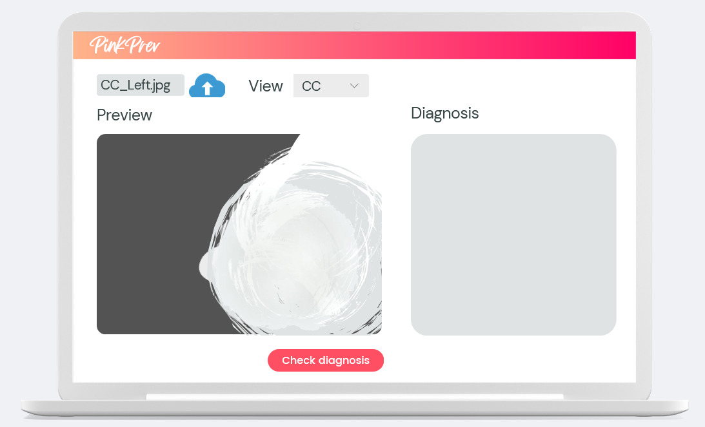

# Arhitectura modelului

## Modelul de bază pentru CC-view (Moroz Alexandra)

Am folosit un model preantrenat: vit_tiny_patch16_224, din biblioteca timm, pentru că este lightweight și potrivit 
pentru datele noastre. 

```python
from timm import create_model
model = create_model('vit_tiny_patch16_224', pretrained=True)
```

Am început cu transformerul [ViT (Vision Transformer)](https://github.com/google-research/vision_transformer?tab=readme-ov-file) 
deoarece o variantă a acestuia era folosit și de [MammoVit](https://www.mdpi.com/2075-4418/15/3/285), un model de referință 
pentru clasificarea imaginilor mamografice. Ne-am inspirat mult din arhitectura acestuia,
[CrossVit](https://github.com/IBM/CrossViT), un model mai performant, dar și mai CPU-intensive la antrenare:


[source](https://www.mdpi.com/2075-4418/15/3/285)

Având destul de puține date de intrare pentru acest view, era necesar să putem antrena rapid modelul pentru a încerca
optimizarea prin modificarea parametrilor de antrenare și a hiper-parametrilor, precum și a preprocesării imaginilor.

```python
from torchvision import transforms
transform = transforms.Compose([
    transforms.Resize((224, 224)),               # Redimensionare la 224x224
    transforms.Grayscale(num_output_channels=3), # Conversia imaginilor grayscale la imagini RGB (3 canale), 
                                                 # pentru compatibilitatea cu modelele preantrenate.
    transforms.ToTensor(),                       # Duce valorile pixelilor la intervalul [0, 1]
    transforms.Normalize([0.5]*3, [0.5]*3)       # Normalizare la intervalul [-1, 1] pentru fiecare canal RGB
])
```

Parametrii și hiper-parametrii folosiți pentru antrenare:

* Optimizer (ex: Adam, SGD, SparseAdam etc.)
* Rata de învățare (ex: 0.001, 0.01, 0.1 etc.)
* Batch size
* Epoci de antrenare
* Funcție de pierdere pentru reglarea dezechilibrului de clase (ex: CrossEntropyLoss, FocalLoss etc.)
* Sampling pentru clase dezechilibrate (ex: WeightedRandomSampler)
* Dispozitiv	GPU (dacă este disponibil), altfel CPU

## Arhitectura ViT

Spre deosebire de CNN-uri, ViT împarte imaginea în patch-uri și procesează secvențial fiecare patch prin capete de atenție.
Modelul ViT tiny are un număr redus de parametri, fiind potrivit pentru date mai puține sau resurse limitate.


[source](https://arxiv.org/pdf/2010.11929)

Vision Transformer (ViT) adoptă o abordare complet diferită inspirată din procesarea limbajului natural. 
În loc să analizeze pixelii prin kernel-uri, ViT împarte imaginea într-o secvență de patch-uri pătrate, 
fiecare tratat ca un „cuvânt” într-o propoziție. Aceste patch-uri sunt apoi proiectate într-un spațiu 
de dimensiuni fixe prin embedding și sunt îmbogățite cu informații despre poziția lor în imagine prin 
adăugarea unor vectori de poziție (positional encoding).

Această secvență de patch-uri este procesată de un encoder Transformer compus din straturi succesive 
de atenție multi-head și rețele neurale feed-forward. Fiecare strat învață să pună în evidență relații 
de dependență între patch-uri, permițând astfel modelului să captureze contexte globale și relații 
spațiale între regiuni îndepărtate ale imaginii — un avantaj important față de receptive field-ul 
limitat al CNN-urilor.

În ciuda dimensiunii sale reduse, ViT Tiny beneficiază de avantajul scalabilității și al preantrenării 
pe seturi mari de date (ImageNet), ceea ce îl face competitiv și în sarcini de clasificare binară, cum 
este identificarea caracterului benign sau malign al unei imagini mamografice.

Un element esențial în arhitectura ViT este tokenul special [CLS], introdus la începutul secvenței de 
patch-uri. Acesta este învățat să agregheze informația din întreaga imagine și este conectat la un cap 
de clasificare (head), reprezentat de un layer liniar care produce logit-uri* corespunzătoare fiecărei 
clase. În cazul de față, modelul a fost adaptat pentru a produce două clase: benign și malign.

(*) logits = valorile numerice produse înainte de aplicarea unei funcții de activare 
(de obicei softmax în clasificare)

## Modelul de bază pentru MLO view (Magui Anca)
Modelul utilizat pentru clasificarea imaginilor mamografice este ResNet-50 (50 de straturi convoluționale, incluzând blocuri reziduale), un CNN profund, preantrenat pe ImageNet și adaptat pentru sarcina noastră binară (benign vs malign). Arhitectura sa este cunoscută pentru introducerea conexiunilor reziduale care facilitează antrenarea rețelelor foarte adânci, evitând problema degradării performanței. 

```transform_train = transforms.Compose([
    transforms.Resize((224, 224)),               # Redimensionează imaginea la 224x224 pixeli (standard pentru ResNet și ViT)
    transforms.RandomHorizontalFlip(),           # Cu probabilitate 0.5, întoarce imaginea pe orizontală (augmentare)
    transforms.RandomRotation(10),               # Rotește aleatoriu imaginea cu până la ±10° (augmentare)
    transforms.ToTensor(),                       # Convertește imaginea din PIL în tensor PyTorch (valori în [0, 1])
    transforms.Normalize([0.485, 0.456, 0.406],   # Normalizează fiecare canal (R, G, B) cu media și std folosite la preantrenare pe ImageNet
                     [0.229, 0.224, 0.225])
])
```
Scop: crește diversitatea datelor și reduce overfitting-ul, păstrând compatibilitatea cu rețelele preantrenate (care așteaptă imagini normalizate după statisticile ImageNet).

Am ales ResNet-50 ca arhitectură de bază datorită performanței sale dovedite în sarcini de clasificare a imaginilor și a faptului că este un model preantrenat pe ImageNet, ceea ce ne oferă un punct de plecare solid chiar și cu un volum mic de date. Este disponibil în PyTorch cu ponderi preantrenate, ușor de integrat.

Deși modelul pleacă de la aceleași ponderi preantrenate, ultimele straturi (ex. fully-connected) sunt reinițializate aleatoriu. Asta duce la mici variații între rulări. În plus:  
    - Ordinea datelor (prin sampler aleatoriu) este diferită la fiecare epocă.   
    - Operațiile de augmentare (rotație, flip etc.) sunt aplicate aleatoriu.   
    - Optimizarea folosește algoritmi stocastici (AdamW), care pot urmări traiectorii diferite în spațiul de învățare.

Consecință: Modelul poate oferi rezultate ușor diferite la două rulări consecutive, chiar cu aceleași date. Aceasta este o caracteristică normală a antrenării în rețele neuronale moderne și este și motivul pentru care se folosesc medii de evaluare reproductibile (seed fix) atunci când este necesară replicabilitatea exactă.

## Arhitectura ResNet-50  

[source](https://www.google.com/url?sa=i&url=https%3A%2F%2Fmedium.com%2Fdata-science%2Fthe-annotated-resnet-50-a6c536034758&psig=AOvVaw2St9MhuTWr1zXuAaGzG1ve&ust=1749066018437000&source=images&cd=vfe&opi=89978449&ved=0CBQQjRxqFwoTCODPsueA1o0DFQAAAAAdAAAAABAE)

ResNet-50 este construită dintr-o succesiune de blocuri convoluționale și blocuri reziduale, fiind una dintre primele arhitecturi care a introdus conceptul de "skip connections" pentru a combate problema degradării performanței în rețelele adânci.

### 1. Zero Padding
Adaugă pixeli de valoare zero la marginea imaginilor de intrare, astfel încât dimensiunile spațiale să se păstreze după aplicarea filtrului convoluțional.

### 2. Blocul Inițial
- **Convoluție (CONV):** Aplică filtre pentru a extrage caracteristici de bază precum muchii și texturi.
- **Batch Normalization:** Normalizează activările pentru a stabiliza și accelera procesul de antrenare.
- **ReLU:** Funcție de activare care introduce nelinearitate în rețea.
- **Max Pooling:** Reduce dimensiunile spațiale, păstrând doar caracteristicile cele mai relevante.

### 3. Blocuri Reziduale (ResNet Blocks)
Rețeaua este compusă din mai multe etape care includ:
- **Convolutional Blocks (Conv Block):** Realizează modificări de dimensiune și învață noi reprezentări. Aceste blocuri includ un shortcut convoluțional pentru a potrivi dimensiunile.
- **Identity Blocks (ID Block):** Păstrează dimensiunile inițiale și conectează direct intrarea la ieșire. Sunt utilizate pentru a menține informația neschimbată atunci când nu este necesară ajustarea dimensională.

Aceste conexiuni reziduale permit modelului să învețe "diferențele" (reziduurile) față de intrare, ceea ce face ca antrenarea rețelelor foarte adânci să fie mai eficientă.

### 4. Straturile Finale
- **Average Pooling:** Reduce dimensiunile spațiale prin calculul mediei globale a activărilor.
- **Flattening:** Transformă tensorul bidimensional într-un vector unidimensional.
- **Fully Connected Layer (FC):** Strat de ieșire care produce predicția finală, în cazul nostru clasificarea în două clase: benign și malign.

### Concluzie
ResNet-50 este o arhitectură profundă și stabilă, utilizată pe scară largă în clasificarea imaginilor medicale. Datorită blocurilor reziduale, rețeaua poate fi antrenată eficient chiar și în contextul unor seturi de date relativ reduse, fiind ideală pentru transfer learning în domenii precum analiza mamografiilor.

# Arhitectura aplicației


## Interfața utilizator



O primă idee despre cum doream să arate interfața.


#Dezvoltarea unei mini-aplicatii software care

    sa primeasca datele de intrare (in formatul corespunzator)
    sa ofere rezultatul (in formatul corespunzator) - hard-coded
    sa fie pregatita pentru a integra modelul de AI

Evaluare:
    dezvoltarea unui model de AI si evaluarea performantei - 300p
    imbunatatiri - 300p
    teaser de prezentare a solutiei dezvoltate - 200p
        ce problema rezolva proiectul (inputs, outputs)
        ce tip de AI s-a folosit
        ce performanta s-a obtinut
        care sunt SGD-urile impactate de un astfel de proiect (motivati alegerea unuia sau mai multor obiective)
