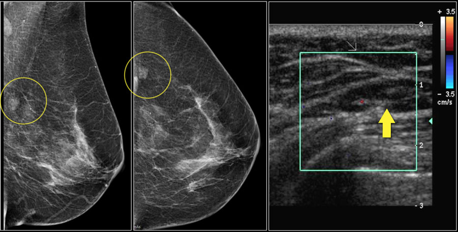
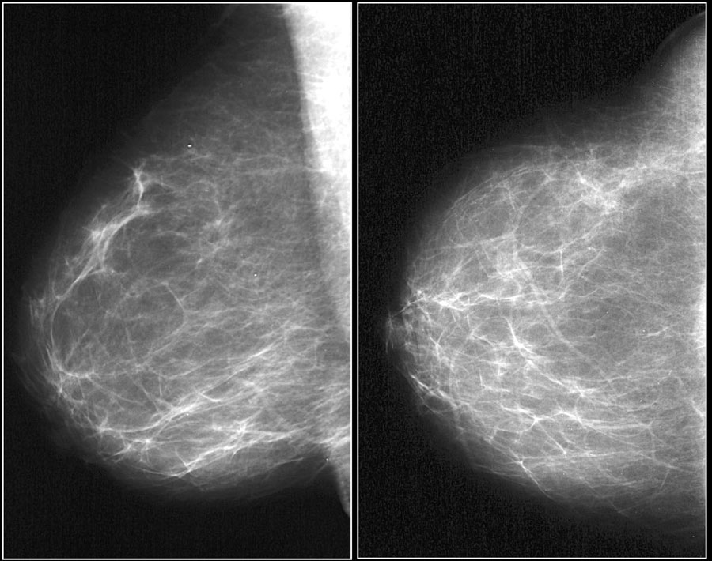
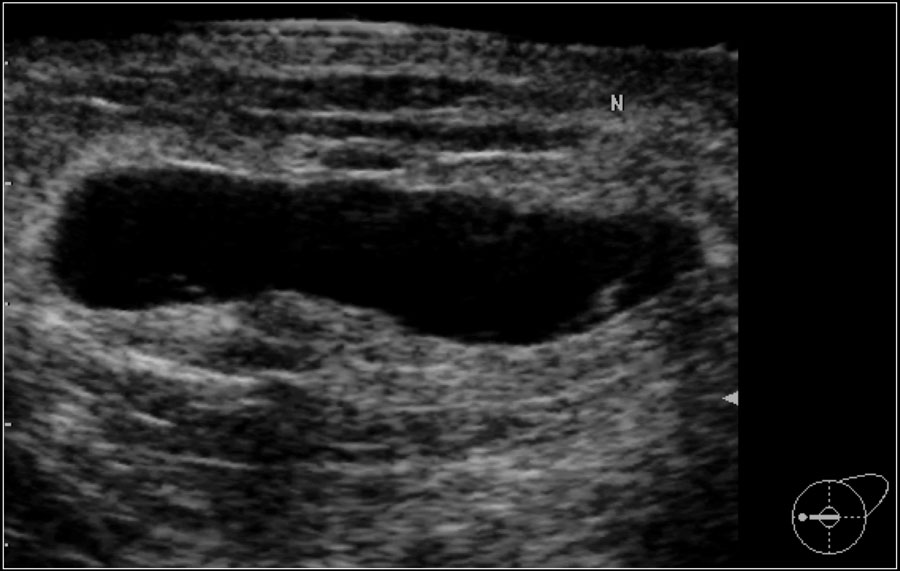
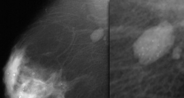
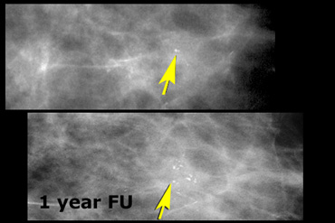
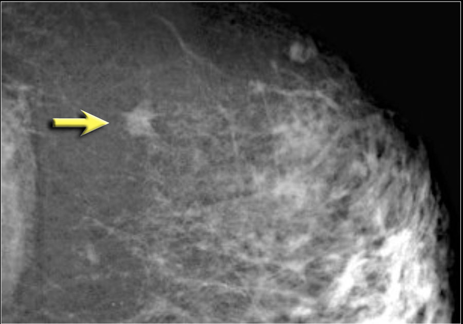
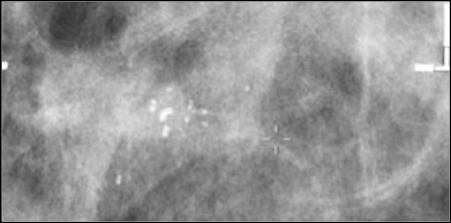
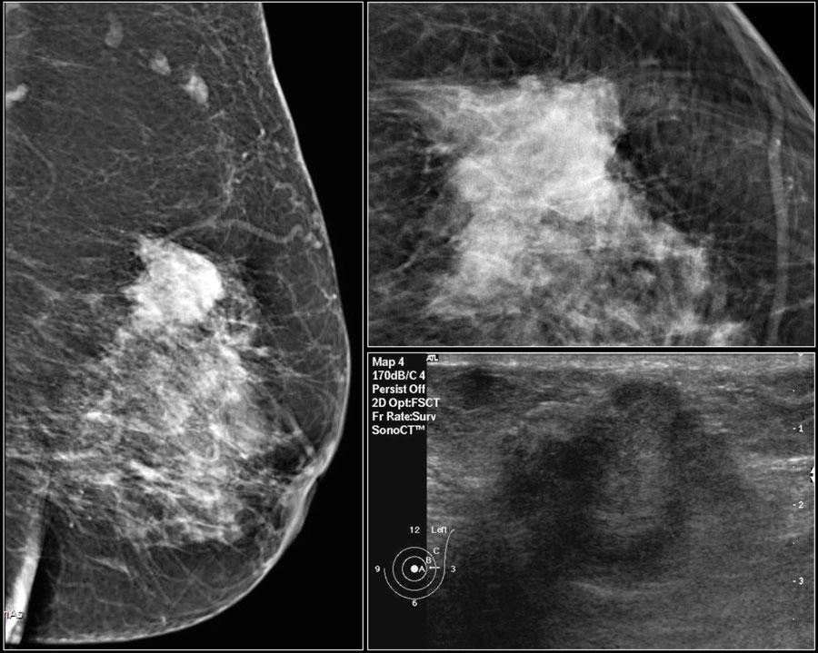
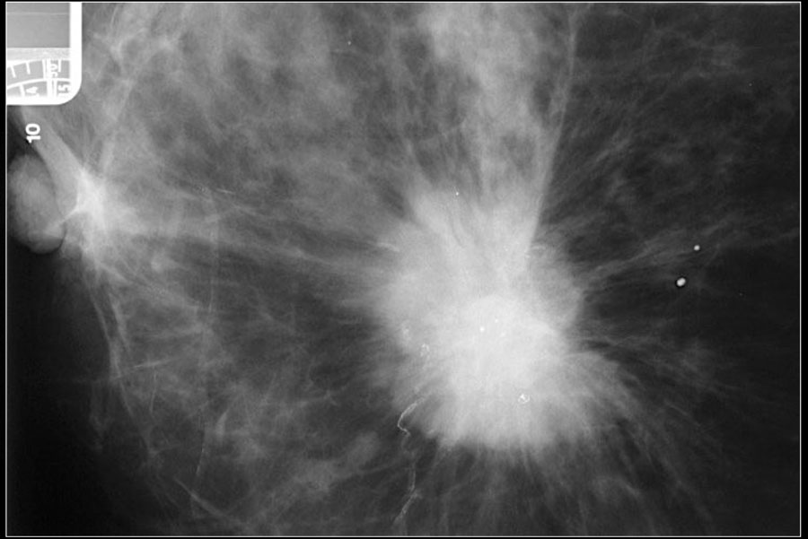

# Definirea problemei

## Procedura de diagnosticare
### Mamografiile - datele de intrare

### Definiție

Mamografia este o procedură de imagistică medicală neinvazivă care folosește raze X de intensitate scăzută pentru a examina țesutul mamar. Este una dintre cele mai eficiente metode de depistare timpurie a cancerului de sân și ajută semnificativ la scăderea riscului de deces din cauza acestei boli. Procedura implică comprimarea sânului între două plăci, pentru a obține imagini clare ale structurii interne a sânului, permițând astfel identificarea unor modificări anormale, cum ar fi noduli, microcalcificări sau mase, înainte ca acestea să devină palpabile sau să provoace simptome vizibile.

#### Tipuri

Există două tipuri de mamografie:

Mamografia de screening, recomandată periodic femeilor fără simptome, în special celor de peste 40-50 de ani, pentru a detecta cancerul într-o fază incipientă.

Mamografia de diagnostic, utilizată pentru investigarea unor simptome deja apărute, cum ar fi noduli palpabili, dureri mamare, secreții sau schimbări ale formei sânului.

#### Utilitate

Procedura este rapidă, de obicei durează câteva minute, și poate provoca un disconfort temporar din cauza comprimării sânului. Totuși, beneficiile sale în depistarea timpurie a cancerului sunt considerabile. În anumite cazuri, medicii pot recomanda imagistică suplimentară, precum ecografia mamară sau RMN-ul, pentru o evaluare mai detaliată.

Mamografia joacă un rol esențial în programele de screening pentru sănătatea femeii și este un instrument important în reducerea mortalității prin cancer mamar, datorită capacității sale de a diagnostica boala într-un stadiu incipient și de a permite un tratament rapid și eficient.

Datele introduse în algoritmul nostru sunt obținute prin intermediul mamografiilor, o metodă eficientă pentru identificarea precisă a celulelor maligne și benigne.

### Diagnosticul - datele de ieșire

Datele de ieșire ale modelului constă într-o etichetă finală însoțită de probabilități – un vector softmax care indică încrederea modelului în fiecare clasă.

În practica radiologică reală BI-RADS nu se calculează automat doar pe baza unei probabilităţi. BI-RADS e un sistem de clasificare clinică care ia în considerare: caracteristicile morfologice și de margini ale leziunii, densitatea țesutului și prezența microcalcificărilor, istoricul pacientului și alte semne subtile.

Caracteristicile morfologice și de margini ale leziunii:
- Formă: o leziune rotundă sau ovală e mai probabil benignă; o formă neregulată poate indica malignitate;
- Marginile: margini bine delimitate sugerează benignitate; margini spiculate (cu proiecții în afară) sau neclare ridică suspiciuni de cancer.
- Structura internă: neomogenă sau cu umbre arhitecturale poate indica un risc crescut;
-> determină dacă leziunea e încadrată ca benignă (BI-RADS 2), incertă (BI-RADS 3–4) sau probabil malignă (BI-RADS 5);

Densitatea sânului:
Există 4 categorii BI-RADS pentru densitate:
A: sân aproape în întregime gras
B: densitate scăzută (țesut fibroglandular dispersat)
C: densitate heterogenă (poate ascunde anomalii)
D: densitate extremă (crește riscul și reduce acuratețea mamografiei)
- în cazul unei densități ridicate se pot recomanda investigații mai detaliate + prudență mai mare 
-> poate face diferența între BI-RADS 3 și 4;

Istoricul medical al pacientei:
- antecedente de cancer mamar, intervenții chirurgicale, tratamente hormonale, vârsta;
-> poate înclina balanța între o clasificare conservatoare (BI-RADS 3) și una mai agresivă (BI-RADS 4–5), chiar și în cazuri neclare

Microcalcificările:
- grupările mici de depozite de calciu pot fi benigne sau pot semnala un început de cancer ductal;
- distribuția, forma și modelul calcificărilor sunt atent analizate;

Clasele BI-RADS:
- 0: radiologul a observat anomalii, dar nu se poate baza doar pe asta pentru a da un diagnostic; se vor cere alte mamograme mai specifice, sau poate chiar unele mai depărtate din punct de vdere temporal, pentru a putea observa eventuale evoluții/modificări;

- 1: normal - negativ - fără noduli, structuri distorsionate sau calcificări suspecte;

- 2: tot un rezultat negativ, dar cu modificări benigne: calcificări benigne, mase sau ganglioni limfatici, sau urmări ale unei biopsii;

- 3: probabilitate foarte mică de a fi cancer (<2% malign); măsuri de siguranță, se va monitpriza în timp - aprox 2 ani, cu reexaminări imagistice la 6-12 luni; nu se vor face biopsii inutile, dar se va monitoriza atent;

- 4: anomalie suspectă - se vor face biopsii

- 5: foarte sugestiv de malignitate - clar cancer - (>= 95% malign)

- 6: malignitate dovedită prin biospsie

## Istoricul Inteligenței Artificiale in diagnosticul medical

### Primele utilizări - anii 1970-2000
Inteligența Artificială (IA) a început să fie aplicată în medicină încă 
din [anii 1970](https://pmc.ncbi.nlm.nih.gov/articles/PMC2752210/). Astfel s-a născut în 1971
primul consultant medical bazat pe IA, [INTERNIST-1](https://www.mdpi.com/2075-1729/14/5/557#B8-life-14-00557),
iar apoi în 1976 [MYCIN](https://www.mdpi.com/2075-1729/14/5/557), un sistem folosit
pentru diagnosticarea infecțiilor bacteriene și recomandarea tratamentului cu antibiotice.
Cu toate acestea, progresul real a fost limitat până la creșterea capacității 
de calcul și a volumului de date medicale digitalizate, în special 
[după anul 2000](https://www.giejournal.org/article/S0016-5107(20)34466-7/pdf).

### Watson - anii 2010
În anii 2010, IBM Watson a fost unul dintre cele mai mediatizate proiecte de Inteligență 
Artificială din domeniul sănătății. După ce a devenit faimos în 2011 câștigând concursul 
de cultură generală *Jeopardy!* împotriva campionilor umani, Watson a fost reorientat 
către aplicații practice, inclusiv în diagnosticul oncologic. Sistemul [Watson for Oncology](https://www.nature.com/articles/s41598-021-84973-5), 
dezvoltat în colaborare cu Memorial Sloan Kettering Cancer Center, promitea să analizeze 
cantități masive de literatură medicală și istorii clinice pentru a oferi recomandări 
personalizate de tratament pentru pacienții cu cancer.

A fost antrenat timp de 4 ani pe date din literatura de specialitate
din ultimii 100 de ani.
Deși inițial a fost privit ca un simbol al viitorului medicinei, Watson s-a confruntat cu 
dificultăți în adaptarea la complexitatea cazurilor reale și la variația sistemelor de
sănătate din întreaga lume. 

Unele spitale au raportat că recomandările sale erau imprecise 
sau inadecvate pentru anumite contexte clinice. În ciuda acestor limitări, Watson a 
deschis calea pentru dezvoltarea altor sisteme AI medicale, iar experiența sa a evidențiat 
provocările integrării IA în practica clinică reală. AI nu putea funcționa ca un “superdoctor” 
autonom. În schimb, s-a conturat ideea de "AI asistent", care sprijină, nu înlocuiește clinicianul.

### În prezent
Diagnosticarea greșită sau întârziată rămâne o problemă majoră în sistemele medicale. 
Potrivit unor studii internaționale, între [10% și 15%](https://pmc.ncbi.nlm.nih.gov/articles/PMC5873736/) 
dintre diagnosticele medicale sunt incorecte. Aceste erori duc la aproximativ 
371.000 de decese anual doar în Statele Unite și încă 424.000 de pacienți rămași cu
dizabilități permanente, dezvăluie un [studiu](https://qualitysafety.bmj.com/content/33/2/109?rss=1) din 2023.
Mai mult, un [alt studiu](https://pmc.ncbi.nlm.nih.gov/articles/PMC5873736/) arată că în 96% dintre cazuri, 
erorile de diagnosticare sunt cauzate de factorii umani: erori la prelevarea datelor,
interpretarea rezultatelor și lipsa verificărilor suplimentare. 

Un [studiu](https://www.nature.com/articles/s41591-024-03408-6) publicat recent în 
Nature Medicine (aprilie 2024) a comparat performanța medicilor radiologi cu un model 
AI avansat în interpretarea mamografiilor.
Inteligența Artificială a obținut o acuratețe medie de 88%, depășind performanța medie a radiologilor umani,
care a fost de 75-85%. De asemenea, IA a demonstrat o consistență superioară, nefiind
influențată de factori precum oboseala sau volumul mare de muncă.

În [martie 2024](https://www.bbc.com/news/technology-68607059), o echipă de cercetători 
a relatat un caz în care IA a identificat mase maligne în 11 mamografii pe care radiologii 
le-au ratat. Mia (acesta este numele modelului) identifică boala cu ani înainte de 
apariția simptomelor sau a unui diagnostic oficial de cancer. Atfel, IA este folosită
nu doar în detectarea cancerului, ci și în predicția evoluției bolii – oferind un avantaj 
crucial în tratamentul timpuriu și reducând timpul de așteptare pentru un diagnostic de la 
14 la 3 zile.

### Modele deja aprobate pentru diagnosticare
Mai multe modele AI au primit aprobări din partea agențiilor de reglementare, cum ar fi FDA 
(Food and Drug Administration) în SUA sau EMA (European Medicines Agency) în Europa. Câteva exemple:

1. [IDx-DR](https://www.aafp.org/pubs/afp/issues/2020/0301/p307.html) – primul sistem AI aprobat de FDA, în 2018, diagnostichează retinopatia diabetică fără intervenția unui medic specialist.

2. [Viz.ai](https://www.viz.ai/news/viz-ai-receives-fda-510k-clearance-for-artificial-intelligence-algorithm-for-the-quantification-of-intracerebral-hemorrhage) – software aprobat pentru detectarea accidentelor vasculare cerebrale prin scanări CT.

3. [Aidoc](https://www.aidoc.com/eu/) și [Zebra Medical Vision](https://www.hbs.edu/faculty/Pages/item.aspx?num=55060) – platforme AI care analizează imagini radiologice pentru o 
    varietate de afecțiuni, de la fracturi la hemoragii cerebrale.

## Utilizarea etică a Inteligenței Artificiale în medicină

### Rolul complementar al inteligenței artificiale în practica medicală  

Inteligența artificială are potențialul de a transforma profund domeniul medical, sprijinind diagnosticarea, personalizarea tratamentelor și analiza unor volume mari de date complexe. Cu toate acestea, este esențial ca IA să fie folosită ca un instrument de suport, nu ca un substitut al medicului. O temă generală care reiese din IA în îngrijirea sănătății este că tehnologia nu este menită să înlocuiască oamenii în medicină și nici nu ar fi etic pentru ei să facă acest lucru, dar există modalități prin care asistenții IA de chat ar putea interveni atunci când profesionistul medical nu este disponibil. Asistenții virtuali bazați pe IA pot interveni pentru a furniza informații preliminare sau pentru a ghida pacienții, fără a substitui însă expertiza umană. Deciziile clinice trebuie să rămână în responsabilitatea profesioniștilor din domeniu, care pot integra informațiile oferite de IA în contextul unic al fiecărui pacient.   

### Exemple de eșecuri ale deciziilor automatizate prin IA   

Există cazuri documentate în care deciziile automatizate prin IA au dus la rezultate negative:  

**IBM Watson for Oncology**   
Este un sistem de asistență medicală bazat pe inteligență artificială, creat pentru a oferi recomandări personalizate de tratament în cancer, prin analizarea datelor medicale și a literaturii de specialitate. Deși a fost dezvoltat în colaborare cu specialiști de la Memorial Sloan Kettering Cancer Center și antrenat pe multiple tipuri de cancer, sistemul a fost intens criticat în ultimii ani pentru că a oferit recomandări „nesigure și incorecte”, ceea ce subliniază limitele IA în interpretarea nuanțelor și a contextului clinic real. Deși Watson for Oncology este deja implementat la scară largă la nivel internațional, el a fost criticat pentru faptul că unele recomandări de tratament au fost inadecvate sau chiar periculoase. Aceste deficiențe ridică semne de întrebare cu privire la încrederea pe care cadrele medicale ar trebui să o acorde acestor sisteme. Dr. Levitan a subliniat că IBM ia în serios aceste observații și lucrează continuu la îmbunătățirea algoritmilor, accentuând faptul că Watson nu trebuie să înlocuiască medicii, ci să-i susțină în luarea deciziilor. Discuția evidențiază și dilemele etice ale utilizării IA în medicină – de exemplu, ce se întâmplă când o decizie automatizată duce la un rezultat greșit și cine poartă responsabilitatea. Aceste aspecte arată cât de importantă este supravegherea umană și menținerea unei abordări etice riguroase în dezvoltarea și implementarea acestor tehnologii. [sursă](https://ascopost.com/issues/september-10-2019/confronting-the-criticisms-facing-watson-for-oncology/)  

**Sistemul de diagnosticare al Google Health**   
Deși sistemul IA dezvoltat de Google Health a demonstrat o acuratețe de peste 90% în detectarea retinopatiei diabetice în condiții de laborator, implementarea sa în clinicile reale din Thailanda a scos la iveală limitări importante. Într-un context clinic aglomerat, cu resurse limitate, sistemul a refuzat peste 20% dintre imagini din cauza calității slabe, cauzate de condiții de iluminare sau de volum mare de pacienți. Acest lucru a dus la întârzieri, frustrare în rândul personalului medical și neplăceri pentru pacienții care trebuiau să se deplaseze ulterior la alte clinici. Studiul subliniază faptul că, deși performanța IA în laborator este impresionantă, aceasta nu garantează succesul în practică. Lipsa unei adaptări la realitățile din teren poate duce la ineficiență și chiar la afectarea accesului la îngrijire. Specialiștii de la Google avertizează că IA trebuie testată riguros în contexte reale și adaptată nevoilor celor care o folosesc înainte de a fi implementată pe scară largă în sănătate. [sursă](https://www.technologyreview.com/2020/04/27/1000658/google-medical-ai-accurate-lab-real-life-clinic-covid-diabetes-retina-disease/)   

### Ghiduri si recomandări pentru utilizarea etică    

**WHO Guidance on Ethics & Governance of AI for Health**    
Organizația Mondială a Sănătății (OMS) a publicat un raport amplu care oferă recomandări pentru dezvoltarea și aplicarea IA în sănătate. Cele 6 principii-cheie:   

        - Protejarea autonomiei umane  
        - Promovarea bunăstării și siguranței   
        - Asigurarea transparenței și explicabilității  
        - Promovarea responsabilității  
        - Asigurarea incluziunii și echității   
        - Promovarea sustenabilității și cooperării internaționale  
[sursă](https://www.who.int/publications/i/item/9789240029200)   

**Ethics Guidelines for Trustworthy AI – Comisia Europeană**   
Pentru ca un sistem IA să fie considerat de încredere, trebuie să respecte următoarele principii stabilite de Comisia Europeană:   

        - Respect pentru lege și reglementări  
        - Respect pentru valorile etice fundamentale  
        - Robust tehnic și social  
[sursă](https://op.europa.eu/en/publication-detail/-/publication/d3988569-0434-11ea-8c1f-01aa75ed71a1)   

### Concluzie  
Inteligența artificială are un potențial enorm de a îmbunătăți actul medical, însă trebuie luate în considerare anumite limite și riscuri etice. Totodată, trebuie înțeles faptul că aceasta trebuie folosită ca un mijloc de sprijin, nu ca un substituent al cadrelor medicale, deoarece experiența a arătat că, în lipsa unei supravegheri umane riguroase și a unei adaptări adecvate la contextul clinic real, IA poate genera erori grave. De aceea, tehnologia trebuie să rămână un instrument complementar, nu un înlocuitor al medicului.   
Este esențială respectarea principiilor etice – transparența, echitatea, protejarea autonomiei pacientului și responsabilitatea – pentru ca IA să contribuie pozitiv la îmbunătățirea îngrijirii medicale. Mai mult decât atât, colaborarea interdisciplinară dintre experți în tehnologie, eticieni și profesioniști din sănătate este crucială pentru a asigura dezvoltarea unor sisteme fiabile, sigure și orientate spre binele pacientului.     
Numai printr-o integrare echilibrată și atentă a inteligenței artificiale în medicină putem garanta că progresul tehnologic se va transforma într-un beneficiu real pentru omenire.

