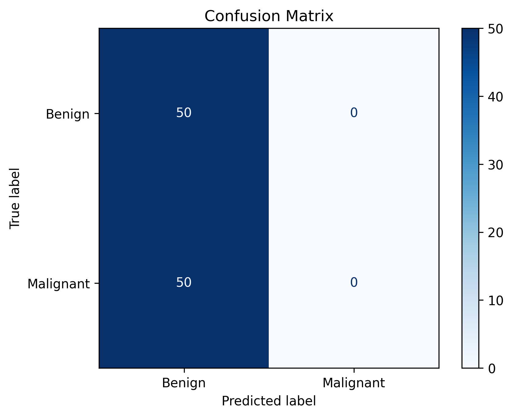
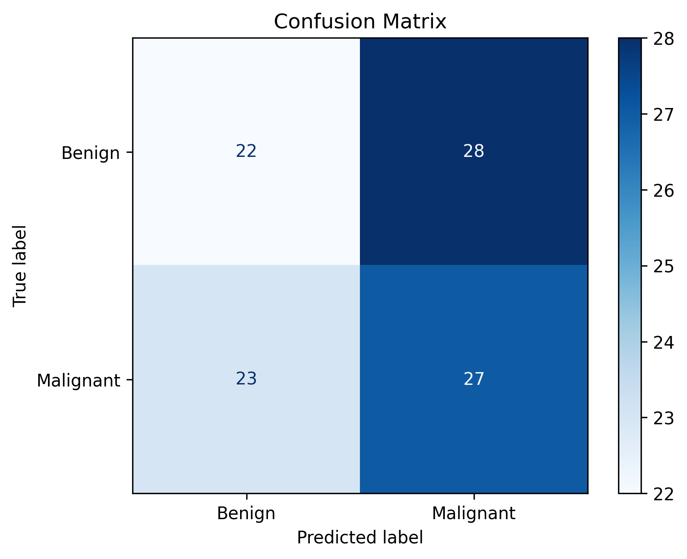
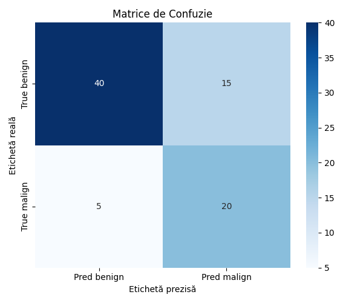

# Dezvoltarea modelului

## Preprocesarea datelor

Pentru fiecare dintre seturile de date MIAS, MammoVit si INbreast, am împărțit imaginile in folderele cu etichete „malign”
sau „benign”. Am folosit un script Python pentru a le redenumi și a le organiza în foldere corespunzătoare, 
astfel încât să fie ușor de utilizat în cadrul modelului.

A trebuit să le separăm în funcție de perspectiva folosită și am oglindit imaginile, pentru a ne asigura că acest factor
nu este luat în calcul pentru diagnostic. Am decis ca toate să fie cu mamelonul în partea dreaptă. Pentru setul de date MIAS
a fost ușor, cum imaginile cu index par erau cu mamelonul în stânga, iar cele cu index impar în dreapta.

Apoi a venit partea de conversie a imaginilor la formatul potrivit pentru modelul nostru, și anume .png. Deși am avut imagini
foarte clare și de bună calitate, unele detalii s-au pierdut prin această transformare.

De exemplu INBreast conținea imagini
cu formatul .dcm (DICOM), care este un format standardizat pentru imagini medicale, dar nu este acceptat direct de majoritatea
modelelor de învățare automată. Un exemplu de script pentru conversia imaginilor DICOM în PNG este următorul:

```python
import os
import cv2
import pydicom
import numpy as np
from pathlib import Path

# Calea către folderul original cu .dcm
input_dir = Path('../dataINbreast/CC')
# Folderul unde salvăm imaginile convertite
output_dir = Path('../dataINbreast/CC-converted')

for class_name in os.listdir(input_dir):
    class_path = input_dir / class_name
    if not class_path.is_dir():
        continue

    out_class_path = output_dir / class_name
    out_class_path.mkdir(parents=True, exist_ok=True)

    for i, filename in enumerate(os.listdir(class_path)):
        if not filename.lower().endswith('.dcm'):
            continue

        dicom_path = class_path / filename
        ds = pydicom.dcmread(dicom_path)
        img = ds.pixel_array

        img = cv2.normalize(img, None, 0, 255, cv2.NORM_MINMAX).astype(np.uint8)

        # Convertire la 3 canale (ViT așteaptă 3 canale RGB)
        img_rgb = cv2.cvtColor(img, cv2.COLOR_GRAY2RGB)

        # Salvare ca PNG
        out_path = out_class_path / f"{class_name}_{i}.png"
        cv2.imwrite(str(out_path), img_rgb)
```

## Modelul mixt
Modelul mixt a combinat perspectivele MLO și CC și a fost prima noatră încercare, înainte de a 
implementa două modele diferite.
Datorită utilizării unor modele pre-antrenate și a antrenării ulterioare pe un set de date mixt, 
modelul reușește să identifice tumorile și imaginile maligne sau benigne, dar nu știe să facă 
diferența între MLO și CC. În teorie, acest lucru poate duce la anumite probleme de performanță, 
dar cu un set de date balansat tehnica ar rămâne fiabilă.

Împărțirea setului de date s-a făcut astfel:

Date de antrenare:
* 2266 imagini benigne
* 125 imagini maligne

Date de test:
* 50 imagini benigne
* 50 imagini maligne

Imaginile au fost distribuite aproximativ în mod egal între CC și MLO. Totuși, din pricina unei 
diferențe mari între numărul de imagini benigne și maligne, au apărut probleme semnificative în 
identificarea imaginilor maligne, rezultând într-o antrenare necorespunzătoare și nefiabilă.

În cadrul dezvoltării modelului am utilizat un model de ResNet50 și de ViT pre-antrenat.

```python
import torch
import torch.nn as nn
import torchvision.models as models

#ResNet50 - model preantrenat pentru extragere de feature din imagini
class ResNet50Backbone(nn.Module):
    def __init__(self):
        super().__init__()
        base_model = models.resnet50(pretrained=True)
        self.backbone = nn.Sequential(*list(base_model.children())[:-2])  

    def forward(self, x):
        return self.backbone(x)

#MammoTransformerHead - partea de Vision Transformer care proceseaza feature-urile de CNN
class MammoTransformerHead(nn.Module):
    def __init__(self, input_channels=2048, embed_dim=768, num_heads=6, num_layers=4, num_patches=49):  # 7x7
        super().__init__()
        self.embedding = nn.Conv2d(input_channels, embed_dim, kernel_size=1)
        self.cls_token = nn.Parameter(torch.randn(1, 1, embed_dim))
        self.pos_embed = nn.Parameter(torch.randn(1, num_patches + 1, embed_dim))  # <-- moved here

        self.transformer = nn.TransformerEncoder(
            nn.TransformerEncoderLayer(d_model=embed_dim, nhead=num_heads, batch_first=True),
            num_layers=num_layers
        )

        self.fc = nn.Linear(embed_dim, 2)

    def forward(self, x):  
        x = self.embedding(x) 
        B, C, H, W = x.shape
        x = x.flatten(2).transpose(1, 2) 

        cls_token = self.cls_token.expand(B, -1, -1) 
        x = torch.cat([cls_token, x], dim=1)  

        x = x + self.pos_embed
        x = self.transformer(x)
        return self.fc(x[:, 0])

#MammoVit - combinatie intre ResNet50 si MammoTransformerHead care ne ofera diagnostic de malign sau benign
class MammoVit(nn.Module):
    def __init__(self):
        super().__init__()
        self.backbone = ResNet50Backbone()
        self.head = MammoTransformerHead()

    def forward(self, x):
        feats = self.backbone(x)        
        logits = self.head(feats)        
        return logits

```

În urma fine-tuningului se poate observa în cadrul a 5 epoci o îmbunătățire de performanță, dar apoi dă overfit.


Din pricina diferenței mari între numărul de imagini maligne și benigne, matricea de confuzie nu a avut succes, modelul considera
toate imaginile ca fiind benigne (raportul de 18:1 intre imagini benigne și maligne).



Îmbunătățire:
În urma re-antrenării modelului cu o distribuție mai bună a datelor s-a obținut o variantă cu o șansă mai mare de succes conform matricii de confuzie:

* 300 imagini benigne
* 100 imagini maligne

Concluzie: Cu toate că modelul a învățat să prezică și imaginile maligne, acuratețea sa a fost scăzută. Modelul reușea să facă predicția
bună în doar jumătate dintre cazuri, ceea ce nu este suficient de bine pentru a fi utilizat în practică.
În plus, a fost testat utilizând un set de date de testare care conținea 50 de imagini benigne și 50 de imagini maligne,
iar în practică imaginile benigne sunt mai des întâlnite.

De aceea am ales să continuăm cu implementarea modelelor diferențiată pe perspectiva mamografiei.

## Modelul CC-view

De la început dezechilibrul datelor a fost o problemă, cu un raport de 4:1 între datele de antrenare maligne și benigne, 
deoarece foloseam doar datele din setul INBreast. Astfel, aveam 39 de imagini maligne și 162 benigne.

Împărțite 80/20 pentru antrenare și validare, am obținut foarte puține date pentru validare, doar 8 imagini maligne și 32 benigne.
Fiind așa de puține mai ales cele maligne, care contau cu adevărat, modelul a avut tendința să le ignore complet.

Primele încercări de antrenare a modelului au fost de aceea biased pentru benign, ceea ce nu era ideal. Am fi
dorit mai degrabă să avem fals pozitive decât fals negative.

Prima dată procesarea datelor nu a fost făcută corespunzător, deoarece am uitat că ViT așteaptă imagini cu 3 canale RGB.
```python
from torchvision import transforms
transform = transforms.Compose([
    transforms.Resize((224, 224)),               # Redimensionare la 224x224
    transforms.ToTensor(),                       # Duce valorile pixelilor la intervalul [0, 1]
    transforms.Normalize([0.5]*3, [0.5]*3)       # Normalizare la intervalul [-1, 1] pentru fiecare canal RGB
])
```
De aceea primele încercări de antrenare a modelului au eșuat, modelul credea toate cazurile benigne:

```
=== Clasificare ===
              precision    recall

      benign       0.78      1.00
      malign       0.00      0.00

    accuracy
   macro avg       0.39      0.50
weighted avg       0.61      0.78

Acuratețe totală: 0.78
```

Apoi am folosit un weighted resampler și un criterion cu CrossEntropyLoss(), încercând să echilibrăm datele:

``` python
class_weights = torch.tensor([1.0,4.5]).to(device)
criterion = nn.CrossEntropyLoss(weight=class_weights)
```


```
              precision    recall

      benign       0.84      1.00
      malign       1.00      0.33

    accuracy
   macro avg       0.92      0.67
weighted avg       0.88      0.85
Acuratețe totală: 0.85
```

Modelul identifica foarte bine cazurile benigne, dar nu reușea să identifice toate cazurile maligne (doar 1/3).
Modificând insă foarte puțin ponderea, modelul vedea automat toate cazurile ca fiind maligne:

``` python
class_weights = torch.tensor([1.0,4.6]).to(device)
criterion = nn.CrossEntropyLoss(weight=class_weights)
```

Văzând că modelul este foarte sensibil la aceste schimbări, am decis să schimbăm preprocesarea datelor, adăugând
transformarea la RGB.

```python
from torchvision import transforms
transform = transforms.Compose([
    transforms.Resize((224, 224)),               # Redimensionare la 224x224
    transforms.Grayscale(num_output_channels=3), # Conversia imaginilor grayscale la imagini RGB (3 canale), 
                                                 # pentru compatibilitatea cu modelele preantrenate.
    transforms.ToTensor(),                       # Duce valorile pixelilor la intervalul [0, 1]
    transforms.Normalize([0.5]*3, [0.5]*3)       # Normalizare la intervalul [-1, 1] pentru fiecare canal RGB
])
```

Am pornit așadar cu un criterion cu ponderea [1.0, 1.0], pentru a vedea cum se comportă cu această preprocesare.

```python
class_weights = torch.tensor([1.0,1.0]).to(device)
```

```
=== Clasificare ===
              precision    recall  f1-score   support

      benign       0.85      0.67      0.75        51
      malign       0.19      0.40      0.26        10

    accuracy                           0.62        61
   macro avg       0.52      0.53      0.50        61
weighted avg       0.74      0.62      0.67        61

Acuratețe totală: 0.62
```

Acum modelul identifica mai multe cazuri ca fiind maligne, dar făcea multe alarme false și tot rata multe cazuri
maligne (60% dintre ele).

Am continuat să ajustăm ponderile, încercând să găsim un echilibru mai bun.

```python
class_weights = torch.tensor([1.0,1.15]).to(device)
```

```
=== Clasificare ===
              precision    recall  f1-score   support

      benign       0.85      0.86      0.85        51
      malign       0.22      0.20      0.21        10

    accuracy                           0.75        61
   macro avg       0.53      0.53      0.53        61
weighted avg       0.74      0.75      0.75        61

Acuratețe totală: 0.75
```

Am văzut că în continuare modelul are tendința să ignore cazurile maligne, așa că am decis să adăugăm și datele maligne din MammoVit,
pentru a reduce din dezechilibrul de clase. Astfel, am avut 102 maligne vs 162 benigne (+63 maligne).
Pentru 10 epoci cu ponderile anterioare am obținut:


```
=== Clasificare ===
              precision    recall  f1-score   support

      benign       0.85      0.93      0.89        55
      malign       0.80      0.64      0.71        25

    accuracy                           0.84        80
   macro avg       0.82      0.78      0.80        80
weighted avg       0.83      0.84      0.83        80

Acuratețe totală: 0.84
```

## Modelul MLO-view

Datele utilizate provin din trei surse principale: **INbreast**, **MIAS** și **MammoVit**. Dintre acestea, numărul total de imagini **maligne** disponibile a fost relativ mic, totalizând **154 de cazuri**. Pentru a menține o reprezentare realistă a distribuției între clase, am păstrat un raport aproximativ de **3:1** între imaginile benigne și cele maligne.

Împărțirea setului de date s-a făcut astfel:
- **Set de antrenare (80%)**
  - 123 imagini maligne
  - 348 imagini benigne
- **Set de validare (20%)**
  - 31 imagini maligne
  - 88 imagini benigne

Această împărțire păstrează consistența distribuției, dar **dezechilibrul între clase rămâne semnificativ**, ceea ce poate influența negativ performanța modelului în identificarea cazurilor maligne.   

Inițial, am experimentat cu modelul **Vision Transformer (ViT)** folosind ponderi manuale pentru a corecta dezechilibrul între clase:   
Transformările au inclus conversia imaginilor grayscale la 3 canale, pentru compatibilitate cu modelele preantrenate:    
```python
transform_train = transforms.Compose([
    transforms.Resize((224, 224)),
    transforms.RandomHorizontalFlip(),
    transforms.RandomRotation(10),
    transforms.Grayscale(num_output_channels=3),
    transforms.ToTensor(),
    transforms.Normalize([0.5]*3, [0.5]*3)
])
transform_val = transforms.Compose([
    transforms.Resize((224, 224)),
    transforms.Grayscale(num_output_channels=3),
    transforms.ToTensor(),
    transforms.Normalize([0.5]*3, [0.5]*3)
])
class_weights = torch.tensor([1.0, 166 / 40], dtype=torch.float).to(device)
loss_fn = torch.nn.CrossEntropyLoss(weight=class_weights)
```
Rezultatele nu au fost satisfăcătoare, în special din perspectiva detectării clasei maligne. Modelul a prezentat semne de overfitting:
```
      Benign       0.79      0.45      0.58        33
      Malign       0.18      0.50      0.27         8

    accuracy                           0.46        41
   macro avg       0.49      0.48      0.42        41
weighted avg       0.67      0.46      0.52        41
```
Am trecut ulterior la un model ResNet-50 preantrenat, utilizând WeightedRandomSampler pentru a contracara dezechilibrul dintre clase, oferind astfel șanse egale de apariție în batch-uri:
```weights = [1.0 / class_counts[t] for t in targets]
sampler = WeightedRandomSampler(weights, num_samples=len(weights), replacement=True)
```
Această abordare a dus la îmbunătățiri semnificative ale performanței, în special pentru clasa malignă:   
```
   Etichete reale: Counter({np.int64(0): 88, np.int64(1): 31})
   Predicții: Counter({np.int64(0): 103, np.int64(1): 16})
              precision    recall  f1-score   support

      Benign       0.83      0.98      0.90        88
      Malign       0.88      0.45      0.60        31

    accuracy                           0.84       119
   macro avg       0.85      0.71      0.75       119
weighted avg       0.85      0.84      0.82       119
```


Deși modelul ResNet-50 a oferit rezultate superioare comparativ cu ViT, un dezavantaj important al metodei folosite este variabilitatea ridicată între rulări. Fiecare antrenare poate produce rezultate ușor diferite pe setul de validare. Totuși, această abordare s-a dovedit mai robustă și mai stabilă în condițiile date, oferind un echilibru mai bun între recall și precizie, mai ales în identificarea cazurilor maligne.


## Metrici de performanță
Pentru evaluarea performanței modelului pe setul de validare, s-au utilizat următorii indicatori standard în clasificare binară:
1. Acuratețea (Accuracy)
2. Precizia (Precision)
3. Recall
```python
from sklearn.metrics import classification_report, accuracy_score
report = classification_report(all_labels, all_preds, target_names=['benign', 'malign'])
accuracy = accuracy_score(all_labels, all_preds)
print("=== Clasificare ===")
print(report)
print(f"Acuratețe totală: {accuracy:.2f}")
```

```
=== Clasificare CC ===
              precision    recall  f1-score   support

      benign       0.89      0.73      0.80        55
      malign       0.57      0.80      0.67        25

    accuracy                           0.75        80
   macro avg       0.73      0.76      0.73        80
weighted avg       0.79      0.75      0.76        80

Acuratețe totală: 0.75
```

```
=== Clasificare MLO ===
              precision    recall  f1-score   support

      Benign       0.83      0.98      0.90        88
      Malign       0.88      0.45      0.60        31

    accuracy                           0.84       119
   macro avg       0.85      0.71      0.75       119
weighted avg       0.85      0.84      0.82       119

Acuratețe totală: 0.84
```

3. Matricea de confuzie, pentru vizualizarea numărului de cazuri TP, FP, FN, TN.
```python
import matplotlib.pyplot as plt
import seaborn as sns
from sklearn.metrics import confusion_matrix
# codul pentru cele 3 metrici
cm = confusion_matrix(all_labels, all_preds)
plt.figure(figsize=(6, 5))
sns.heatmap(cm, annot=True, fmt='d', cmap='Blues',
            xticklabels=['Pred benign', 'Pred malign'],
            yticklabels=['True benign', 'True malign'])
plt.title('Matrice de Confuzie')
plt.xlabel('Etichetă prezisă')
plt.ylabel('Etichetă reală')
plt.tight_layout()
plt.show()
```



