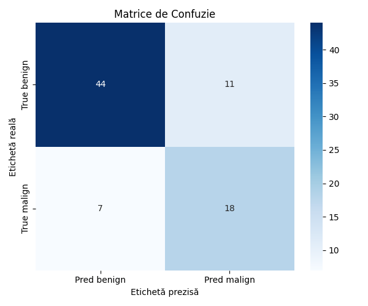
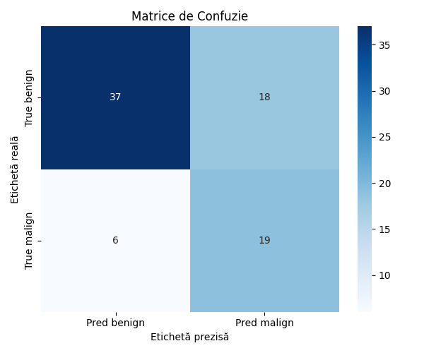
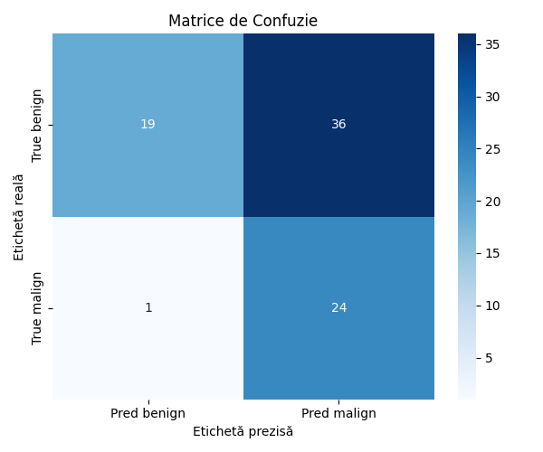
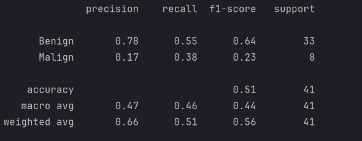
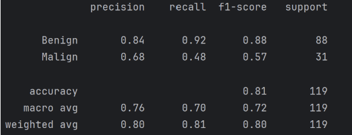
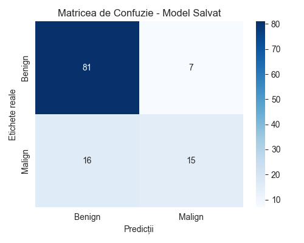

# Îmbunătățiri

## Model CC-view (Moroz Alexandra)

O îmbunătățire făcută a fost impărțirea datelor 70/30 pentru a avea un număr mai mare de date de testare,
astfel metricile de performanță fiind mai relevante.

Mai departe am observat comportamentul modelului în funcție de numărul de epoci de antrenare.
Am obținut pentru 15 epoci (vs 10 epoci înainte):


```
=== Clasificare ===
              precision    recall  f1-score   support

      benign       0.89      0.73      0.80        55
      malign       0.57      0.80      0.67        25

    accuracy                           0.75        80
   macro avg       0.73      0.76      0.73        80
weighted avg       0.79      0.75      0.76        80

Acuratețe totală: 0.75
```

Observăm că acum modelul este mai predispus să prezică malignitatea, dar măcar ratează mai puține
cazuri real maligne.

```python
class_weights = torch.tensor([1.0,1.15]).to(device)
```
Aceste valori au fost obținute experimental, dacă creștem și mai mult weight-ul la clasa malignă, obținem rezultate
mai slabe. De exemplu, pentru [1.0,1.20] avem următoarea matrice de confuzie:



Chiar dacă clasifică bine mai bine cazurile benigne, am dori să scadă numărul de cazuri în care
modelul considera o imagine malignă ca fiind benignă.

O opțiune ar fi creșterea numărului de batch-size de la 16 la 32:
```python
train_loader = DataLoader(train_dataset, batch_size=32, sampler=sampler)
val_loader = DataLoader(val_dataset, batch_size=32, shuffle=False)
```

Pentru [1.0,1.15] și 5 epoci:


Pentru [1.0,1.4] și 5 epoci:


```
              precision    recall  f1-score   support

      benign       0.95      0.35      0.51        55
      malign       0.40      0.96      0.56        25

    accuracy                           0.54        80
   macro avg       0.68      0.65      0.54        80
weighted avg       0.78      0.54      0.52        80

Acuratețe totală: 0.54
```
Observăm că acum accuratetea totala are de suferit, dar modelul identifica corect 96% dintre cazurile maligne, ceea ce este foarte bine.

În schimb, trage multe semnale de alarmă falsă, și doar 35% dintre cazurile benigne sunt prezise corect.

Am încercat și utilizarea modelului ResNet-50, dar pe seturi mici de date acesta se comportă mai slab decât ViT. Îm plus, antrenarea
durează mult mai mult - 5 epoci de antrenament cu modelul ResNet-50 sunt cât 15 epoci cu ViT.

Așadar, în final configurația câștigătoare a fost următoarea:

```python
# Transformări
transform = transforms.Compose([
    transforms.Resize((224, 224)),
    transforms.Grayscale(num_output_channels=3),  # 3 channels for pretrained models
    transforms.ToTensor(),
    transforms.Normalize([0.5]*3, [0.5]*3)
])

# Împărțire 70-30 pentru train și testare
train_size = int(0.7 * len(full_dataset))
val_size = len(full_dataset) - train_size
train_dataset, val_dataset = random_split(
    full_dataset, [train_size, val_size],
    generator=torch.Generator().manual_seed(42)
)

# Extragem etichetele doar pentru subsetul de training
train_targets = [full_dataset.targets[i] for i in train_dataset.indices]

# Calculează ponderile inverse în funcție de frecvența claselor
class_counts = Counter(train_targets)
class_weights = [1.0 / class_counts[t] for t in train_targets]
sample_weights = torch.DoubleTensor(class_weights)

# Sampler ponderat pentru datele de antrenare
sampler = WeightedRandomSampler(sample_weights, num_samples=len(sample_weights), replacement=True)

# DataLoader pentru train și val
train_loader = DataLoader(train_dataset, batch_size=16, sampler=sampler)
val_loader = DataLoader(val_dataset, batch_size=16, shuffle=False)

# Model Vision Transformer preantrenat
model = create_model('vit_tiny_patch16_224', pretrained=True)
# Înlocuirea claselor de ieșire
model.head = nn.Linear(model.head.in_features, 2)  # 2 clase: benign vs malign

device = torch.device("cuda" if torch.cuda.is_available() else "cpu")
model.to(device)

class_weights = torch.tensor([1.0,1.15]).to(device)
criterion = nn.CrossEntropyLoss(weight=class_weights)

optimizer = optim.Adam(model.parameters(), lr=0.001)

for epoch in range(13):
    model.train()
    total_loss = 0
    for images, labels in train_loader:
        images, labels = images.to(device), labels.to(device)
        optimizer.zero_grad()
        output = model(images)
        loss = criterion(output, labels)
        loss.backward()
        optimizer.step()
        total_loss += loss.item()

    print(f"Epoch {epoch + 1}, Loss: {total_loss / len(train_loader):.4f}")

model.eval()

torch.save(model.state_dict(), 'vit_mammo_96_malign.pth')
```

### Parcurs Model MLO (Anca Magui)

Ca primă abordare, am utilizat modelul **ViT (Vision Transformer)**, mai precis varianta preantrenată `google/vit-base-patch16-224-in21k` disponibilă în biblioteca `transformers` de la Hugging Face.  
Am folosit o functie de pierdere `CrossEntropyLoss` ponderată pentru a combate dezechilibrul de clasă. Am aplicat **ponderare explicită în funcția de pierdere**: `[1.0, 166 / 40]`.  
Deși ViT a funcționat corect din punct de vedere tehnic, performanțele în contextul unui set redus și dezechilibrat au fost **nesatisfăcătoare**. F1-score-ul a variat semnificativ și modelul a fost instabil. În special, ViT s-a dovedit **sensibil la volum mic de date** și necesita o etapă mai robustă de preantrenare pe imagini medicale, care nu era disponibilă.  
  

După observarea unui dezechilibru semnificativ între clase (benign vs. malign) în datele inițiale, am decis să **completăm setul de date cu imagini maligne din MammoViT**. Această extindere a dus la o îmbunătățire a raportului între clase și a permis antrenarea unui model mai stabil, fără a mai fi necesară **ponderarea explicită în funcția de pierdere (loss function)**. ResNet-50 este mai putin sensibil decât ViT în lipsa datelor de preantrenare pe domeniu medical. Focal Loss s-a comportat mai bine decât `CrossEntropyLoss` ponderat manual, deoarece penalizează dinamic erorile pe clasa minoritară, fără a necesita ajustări rigide. Modelul antrenat cu ResNet50 a obținut scoruri mai bune la recall și F1, esențiale în contextul detecției medicale.   
   


Rezultatele arată că **modelul ResNet-50 este bine adaptat contextului datelor dezechilibrate**. Chiar și fără ponderare explicită în funcția de pierdere, modelul a învățat să generalizeze rezonabil asupra cazurilor maligne, menținând o performanță înaltă pe clasa benignă.

## Propuneri de îmbunătățiri pentru viitor
- Adăugarea de noi seturi de date pentru a îmbunătăți acuratețea modelului, cum ar fi
cele din seturile ce nu ne-au fost accesibile din lipsa spațiului de stocare.
- Dezvoltarea unui model care să indice și zona suspectă din imagine, nu doar diagnosticul.
- Securizarea informațiilor medicale trimise prin rețea prin encoding


